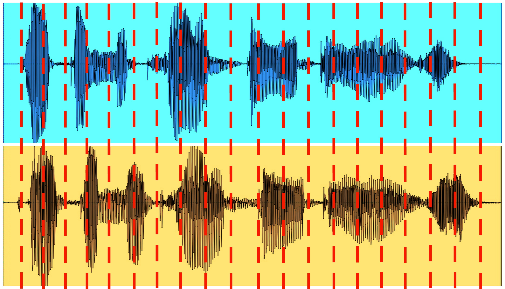
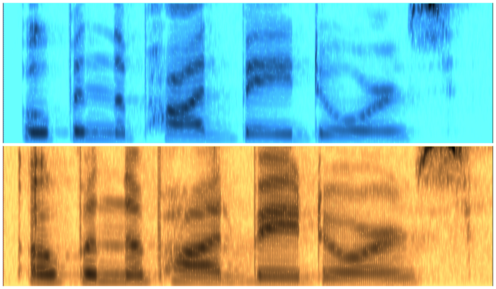
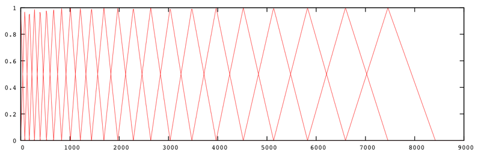

Speaker Verification
=======

This web app records and tests audio input against a pre-recorded voice password to verify speaker identity.

###Feature Analysis
#####(analysis_2.py)
Audio features are extracted using signal processing and Mel Frequency Cepstral Coefficient analysis. First, the original password is analyzed, and the extracted features create a unique voiceprint. Then the test audio recorded in the browser is analyzed and features extracted.

###Dynamic Time Warping
#####(dynamic.py)
After the features for the voiceprint and the test audio are extracted, they are compared to each other using Dynamic Time Warping. The output of this step is a number that represents how similar the two sets of features are. The closer the number is to zero, the more similar the features. After multiple tests, a base number is selected which determines whether or not a test audio is a match.

###Web App
#####(app.py, recorder.js, recorder.html)
Currently, the user is able to record his or her voice in the browser. The test audio is then saved temporarily and tested against my password. This portion utilizes Python, Flask, HTML5, Bootstrap, JavaScript, AJAX, and the navigator.getUserMedia() API.

###How Does It Work?

#####Each audio file is read using the Python numpy library. What you get is a list of numbers, or samples, and a rate. The above wavforms are these numbers when plotted as amplitude by time. A common rate for recording is 44,100 samples per second. To extract our features, we need to analyze this set of data in uniform segments.

#####These segments are then converted from the time domain to the frequency domain using the Fast Fourier Transform algorithm. The above diagram shows time by frequency, and the grayscale represents amplitude; darker means higher amplitude. This is called a Spectrogram.

#####The FFT's are then passed through Mel Filterbanks, like the one above. This lets us analyze the audios similarly to how our ears analyze sounds. The filterbanks are closer together in the lower frequencies, because we are able to differentiate between tones better at low tones. As tones get higher, it takes a larger jump between frequencies for us to tell the difference in tone.

